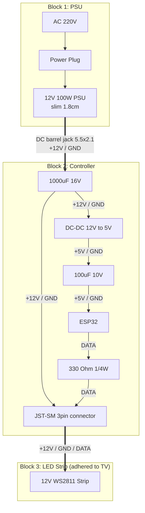

# Tizen OS Ambilight

DIY ambilight for Samsung Tizen TVs — captures edge colors directly from the TV's video processor, no external hardware needed for capture.

## Components

### TV Service (`tv/`)

.NET Tizen service that captures screen edge colors via the TV's hardware PPI and sends them over UDP. See [tv/README.md](tv/README.md) for details.

### Desktop Server (`tools/server.py`)

Python + tkinter GUI:
- Responds to TV discovery broadcasts
- Receives and visualizes edge colors around a rectangle
- Receives HTTP log events from the TV service

### LED Controller (TODO)

Forward edge colors to an LED strip controller (ESP32 + WS2811).

## Hardware Schematic (ESP32 + 12V LED Strip)



## Setup

### Prerequisites

- Samsung Tizen TV (tested on Tizen 9.0, SDP platform)
- [Tizen Studio](https://developer.tizen.org/development/tizen-studio/download) or VS Code Tizen extension
- Samsung partner certificate (for the `contentanalysis` privilege)
- .NET 6.0 SDK with Tizen workload
- Python 3 with tkinter

### Build & Deploy

```bash
# Build the TV service
cd tv/service
dotnet build -c Release

# Package and install via Tizen tools or sdb
# The .tpk is in bin/Release/net6.0-tizen9.0/

# Start the desktop server
python3 tools/server.py
```

### Network

TV discovers the server automatically via UDP broadcast. Both devices must be on the same LAN.

| Port | Protocol | Direction    | Purpose          |
|------|----------|--------------|------------------|
| 9000 | HTTP     | TV -> Server | Log events       |
| 9001 | UDP      | TV -> Server | Edge color data  |
| 9003 | UDP      | Broadcast    | Server discovery |

## Disclaimer

> This project was created solely for **educational purposes** through reverse engineering.
>
> The author assumes **no responsibility** for any use of this code, including but not limited to violation of third-party software terms of service, damage to equipment, or any other consequences.
>
> Use at your own risk.

## License

MIT License. See [LICENSE](LICENSE).
