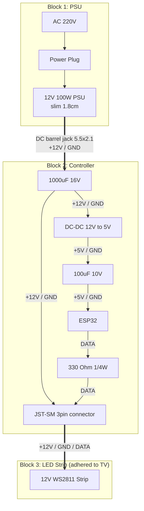

# Hardware Schematic (ESP32 + 12V WS2811 LED Strip)

## Wiring diagram

## Component list

| Component | Value / Part | Notes |
|-----------|-------------|-------|
| PSU | 12V 100W slim (1.8cm) | Fits behind most TVs |
| Input capacitor | 1000 µF / 16V | On 12V rail, close to LED strip input |
| DC-DC converter | 12V → 5V | Powers ESP32 |
| Output capacitor | 100 µF / 10V | After DC-DC, before ESP32 |
| Microcontroller | ESP32 (any variant) | GPIO 23 → DATA |
| Series resistor | 330 Ω / 1/4W | Between ESP32 and DATA line — prevents ringing |
| Connector | JST-SM 3-pin | +12V / GND / DATA to LED strip |
| LED strip | 12V WS2811 | Adhered to the back of the TV |

## Notes

- The 330 Ω resistor on the DATA line dampens signal ringing on long runs — do not omit.
- Place the 1000 µF capacitor as close to the LED strip power input as possible.
- ESP32 DATA pin is GPIO 23 (set in `esp32/src/LEDController.h` as `LED_PIN`).
- Maximum addressable LEDs: 1500 (set in `LEDController.h` as `MAX_LEDS`).
- PSU barrel jack: 5.5 × 2.1 mm, center-positive.
