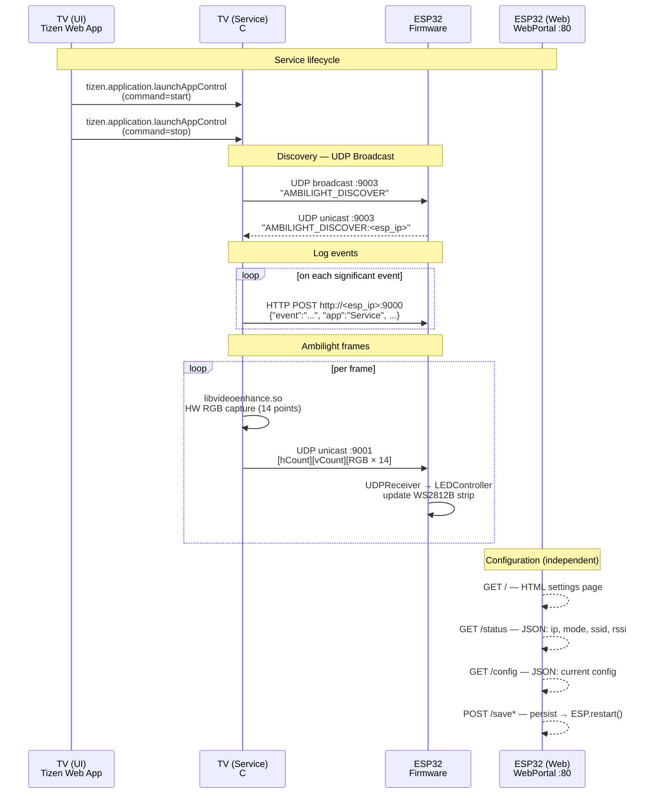

# Networking

## Channels

| Channel | Protocol | Port | Direction |
|---|---|---|---|
| UI → Service | Tizen AppControl IPC | — | start / stop |
| Service → ESP32 | UDP broadcast | 9003 | discovery probe |
| ESP32 → Service | UDP unicast | 9003 | reply with IP |
| Service → ESP32 | HTTP POST | 9000 | log events |
| Service → ESP32 | UDP unicast | 9001 | RGB frames |
| Browser → ESP32 Web | HTTP | 80 | configuration |
